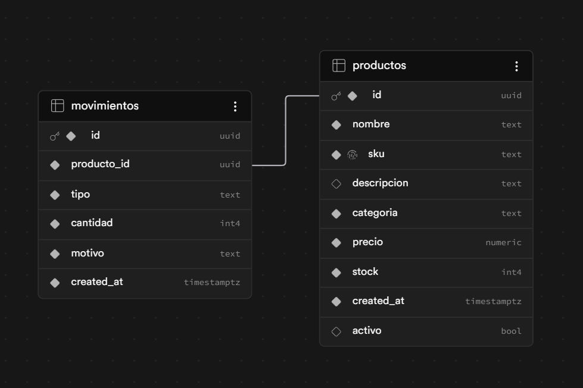

# Sistema de Gestión de Inventario 🚀

Un sistema web completo, moderno y responsivo enfocado en la gestión eficiente de stock y auditoría de movimientos de productos. Desarrollado en un plazo de 7 días como parte del proceso de selección para el puesto de Software Engineer Web en AranguriApps.

## 🛠️ Stack Tecnológico & Arquitectura

- **Frontend:** Next.js 14+ (App Router) con TypeScript y Tailwind CSS para una interfaz limpia, tipada y de alto rendimiento.
- **Backend & Base de Datos:** Supabase (BaaS) para la persistencia de datos relacionales en PostgreSQL y manejo ágil del inventario.
- **Despliegue:** Vercel (Integración Continua / Despliegue Continuo).


### 📐 Modelo de Datos (DER)

El sistema utiliza Supabase (PostgreSQL) como base de datos relacional. A continuación se detalla la estructura y relación de las tablas implementadas, incluyendo el soporte para borrado lógico (`activo`) e historial de auditoría de stock:



### ¿Por qué esta arquitectura?
Se eligió **Next.js con App Router** por su capacidad para combinar Server Components (carga de datos ultra rápida desde el servidor en la página de edición/creación) con Client Components para la interactividad de las tablas y filtros. **Supabase** permitió acelerar el desarrollo del backend sin sacrificar la robustez de una base de datos relacional con integridad referencial, ideal para vincular productos con sus respectivos movimientos de stock.

## 🤖 Orquestación de Inteligencia Artificial & Criterio de Auditoría

En línea con los requerimientos modernos de velocidad y optimización, este proyecto implementa un flujo de trabajo asistido por IA, donde el valor agregado radicó en el **criterio técnico y auditoría humana**:

- **v0 de Vercel (Generativa UI):** Utilizada para prototipar rápidamente las vistas principales de la aplicación (Dashboard, Formulario e Historial), garantizando interfaces estéticas y accesibles desde el día uno.
- **Asistentes LLM & GitHub Copilot:** Integrados para acelerar la escritura de la lógica de negocio y mapeos de datos.

### 🛡️ Casos de Auditoría y QA Propio (Resolución de Conflictos):
La IA suele ignorar restricciones profundas de backend o tipados estrictos. Durante el desarrollo, tomé el rol de auditora principal en los siguientes escenarios críticos:
1. **Validación de Constraints en Postgres:** Al integrar el formulario con Supabase, la IA generaba strings genéricos para los tipos de movimientos. Tuve que intervenir el código para sincronizar los datos del frontend con el `CHECK CONSTRAINT` de la base de datos, evitando fallos de inserción silenciosos.
2. **Tipado Estricto en TypeScript:** Corregí inconsistencias donde la IA omitía la propiedad obligatoria `status` al mapear las respuestas de la base de datos hacia las interfaces del cliente, asegurando que la aplicación compile sin *warnings* ni código roto.
3. **Estrategia de Borrado Lógico (Soft Delete):** Con el fin de resguardar la integridad referencial y mantener intacto el historial contable de auditoría en la tabla de movimientos, se descartó el uso de operaciones `DELETE` físicas. En su lugar, se diseñó e implementó un sistema de borrado lógico mediante una bandera (`activo: boolean`) controlada desde el cliente, asegurando la consistencia relacional de la base de datos de manera definitiva.
4. **Resolución de Errores de Hidratación en Next.js:** Durante la reestructuración de la tabla del Dashboard para incorporar la nueva columna de imágenes, identifiqué y solucioné un fallo de hidratación provocado por nodos de texto/espacios en blanco inválidos generados de manera asíncrona dentro de las etiquetas estructurales <tr> y <thead>. Corregí la sintaxis del JSX asegurando un árbol de renderizado idéntico entre el servidor (SSR) y el cliente.

## 🚀 Almacenamiento de Imágenes y Decisiones Técnicas

Originalmente, el formulario de productos utilizaba un campo de texto plano para ingresar URLs de imágenes de prueba (Mockups). Para llevar el sistema a un entorno real y productivo, se implementó un flujo completo de carga de archivos físicos:

1. **Infraestructura de Almacenamiento (Supabase Storage):**
   * Se creó un bucket público llamado `productos` para almacenar de forma eficiente los archivos binarios de las imágenes.
   * Se configuró con acceso público (`Public bucket`) para permitir que cualquier navegador web pueda renderizar las fotos directamente mediante URLs optimizadas.

2. **Seguridad mediante Row-Level Security (RLS):**
   * Inicialmente, las inserciones eran rechazadas por las políticas estrictas de Postgres (`StorageApiError: new row violates row-level security policy`).
   * Para solucionarlo, se diseñaron e implementaron dos políticas específicas de seguridad para el rol público (`anon`/`public`):
     * **Política de Inserción (`INSERT`):** Permite a la aplicación Next.js subir los archivos directamente al bucket desde el cliente sin trabas de extensiones ni subcarpetas complejas.
     * **Política de Lectura (`SELECT`):** Garantiza que las imágenes puedan ser consultadas y visualizadas correctamente en el Dashboard y el Historial de Movimientos.

3. **Evolución del Esquema de la Base de Datos:**
   * Se alteró la estructura de la tabla `productos` añadiendo la columna `imagen_url` (tipo `text`), permitiendo persistir la URL pública devuelta por el Storage de Supabase de manera integrada con el resto de los datos del producto (nombre, SKU, precio, stock).

4. **Experiencia de Usuario (UX) en el Frontend:**
   * Se modificó el componente `components/product-form.tsx` para soportar estados locales que manejan el archivo binario (`File`).
   * Se incorporó una previsualización inmediata en tiempo de ejecución utilizando `URL.createObjectURL(imageFile)`, evitando que el usuario deba esperar a que termine la subida a internet para ver su foto.

4. **Mapeo Resiliente y Fallbacks de UI:**
   * Al conectar la base de datos con la grilla principal, la IA tendía a ignorar las diferencias entre las convenciones de nombres de la base de datos (imagen_url en Postgres) y el tipado del cliente (imageUrl en TypeScript). Intervine la función de carga (fetchProducts) para asegurar un mapeo limpio y estricto de las propiedades.
   * Además, se diseñó un sistema de fallback visual utilizando componentes de Lucide (ImageIcon) dentro de un contenedor estilizado. Esto garantiza que si un producto antiguo no posee una imagen cargada (o si el campo viene vacío), la interfaz de usuario mantenga una estructura limpia, simétrica y libre de imágenes rotas.

## 📋 Requisitos del Sistema (Vistas Implementadas)

1. **Dashboard Principal:** Resumen visual de métricas del negocio (Stock bajo, valor total del inventario en base a precio × stock) junto a una tabla interactiva de productos con filtros combinados por búsqueda de texto (Nombre/SKU) y categorías.
2. **Formulario de Productos:** Flujo unificado que maneja la creación y edición dinámica de registros en Supabase usando parámetros de URL (`searchParams`), manteniendo el proyecto compacto y sólido.
3. **Historial de Movimientos:** Módulo de auditoría que registra en tiempo real las entradas y salidas de stock con motivos específicos, resolviendo la relación de llaves foráneas (`JOIN`) con la tabla de productos.
4. **Baja de Productos (UX/UI Optimizada):** Se integró un botón de eliminación que despliega una interfaz de confirmación modal nativa en React y Tailwind CSS, evitando alertas intrusivas del navegador y notificando el éxito de la operación mediante un banner flotante (Toast) temporizado.


## 🧪 Pruebas Unitarias (Testing)

El proyecto incluye pruebas unitarias automatizadas orientadas a asegurar la robustez de la lógica de negocio (cálculo de variaciones de stock dinámico y formateo de datos monetarios). 
Tras las refactorizaciones de la base de datos para dar soporte a imágenes físicas, la suite de pruebas fue ejecutada con éxito garantizando regresión cero sobre las reglas críticas del negocio.

Para la suite de pruebas se seleccionó **Vitest**, garantizando ejecuciones ultrarrápidas y compatibilidad total con TypeScript.

Para correr los tests en un entorno local, ejecutá el siguiente comando:
    ```bash
    pnpm test
    ```


## 🚀 Instalación y Ejecución Local

Para correr este proyecto localmente, seguí estos pasos:

1. **Clonar el repositorio:**
   ```bash
   git clone https://github.com/MarilynDaiana/Inventario.git
   cd Inventario

2. Instalar dependencias
    ```bash
    pnpm install

3. Configurar variables de entorno:
    Creá un archivo .env.local en la raíz del proyecto y agregá tus credenciales de Supabase:

    NEXT_PUBLIC_SUPABASE_URL=tu_url_de_supabase
    NEXT_PUBLIC_SUPABASE_ANON_KEY=tu_clave_anonima_publica

4. Iniciar el servidor de desarrollo:
    ```bash
    pnpm dev

5. Abrí http://localhost:3000 en tu navegador para ver el resultado.

